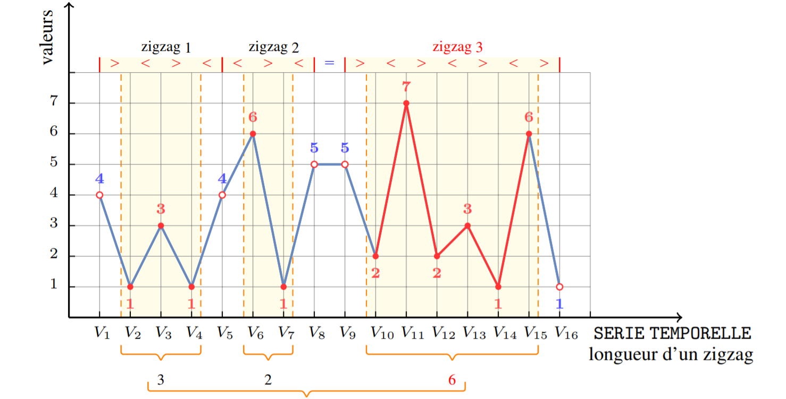

# Capitrain SeriesTemporelles

Maël MAINCHAIN & Chloé GUILBAUD

Projet Sensibilisation à la recherche - Genération de Code pour des Séries Temporelles

N. Beldiceanu, TASC (CNRS) IMT Atlantique, France, nicolas.beldiceanu@imt-atlantique.fr

## Table des matières

1. [Contexte](docs/Context.md)
2. [Installation](docs/Installation.md)
3. [Utilisation](docs/Utilisation.md)
4. [Syntaxe du Seed Transducer](docs/SeedTransducer.md)
5. [Syntaxe de la table de décoration](docs/DecorationTable.md)
6. [Erreur de parsing](docs/ParsingErrors.md)
7. [Conception](docs/Conception.md)
7. [Contrôle qualité](docs/Testing.md)
8. [Gestion de projet](docs/ProjectManagement.md)
9. [Compte rendu hebdomadaire](docs/WeeklyReport.md)
10. [Librairies](docs/Library.md)

## Contexte

Une serie temporelle est une séquence d’entiers correspondant à des mesures effectuées
a intervalles réguliers. Les séries temporelles se rencontrent dans un grand nombre 
de domaines tels par exemple des mesures d’electricité produite par des stations, des
mesures de temperature, d’humidité ou de CO2 dans de grande infrastructures. Etant
donnée une série temporelle on calcule différentes caractéristiques telles que la hauteur 
du plus grand pic ou la longueur du plus long zigzag afin de detecter des similarités
entre plusieurs series temporelles ou des anomalies venant par exemple de capteurs
defectueux. La figure suivante illustre le calcul d’une telle caractéristique, à savoir la
longueur maximum d’un zigzag (un zigzag est une alternance stricte d’augmentation et
de diminution des valeurs de mesures consecutives). Comme il existe un nombre important
d’indicateurs calculables on s’interesse à une approche systématique pour calculer
des indicateurs sur des series temporelles.

## Liens

- Document de recherche
<a href="https://link.springer.com/article/10.1007%2Fs10601-015-9200-3">https://link.springer.com/article/10.1007%2Fs10601-015-9200-3</a>
- Catalogue de contraintes
<a href="https://arxiv.org/ftp/arxiv/papers/1609/1609.08925.pdf">https://arxiv.org/ftp/arxiv/papers/1609/1609.08925.pdf</a>