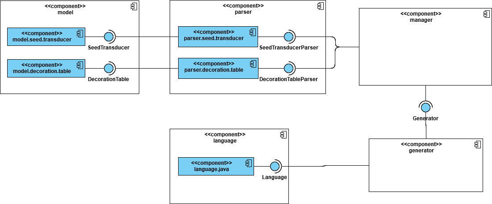
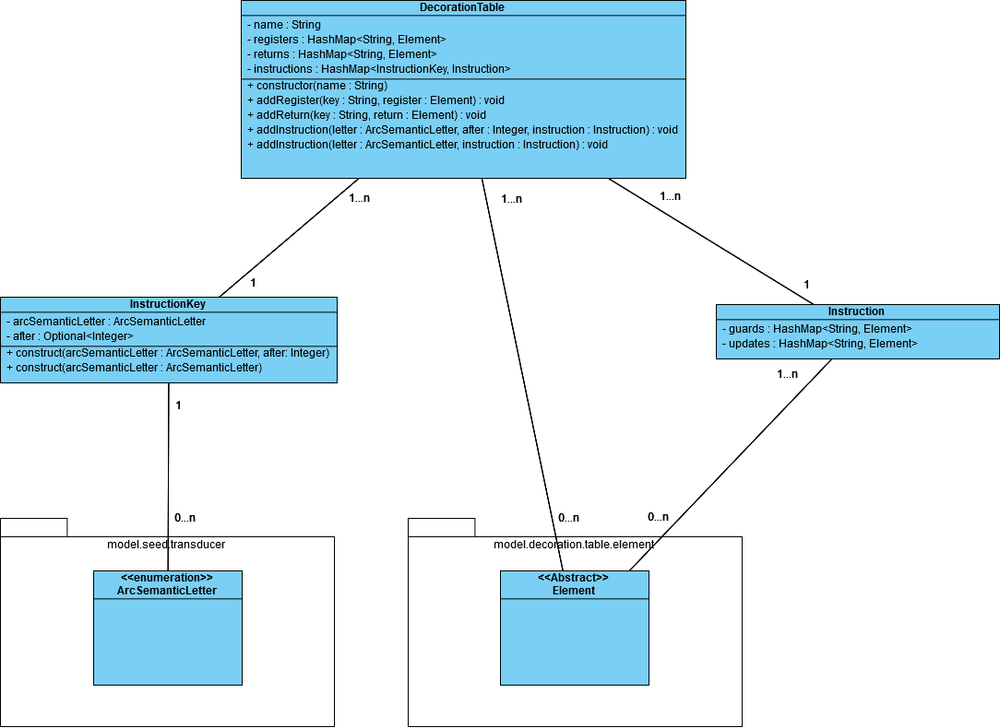
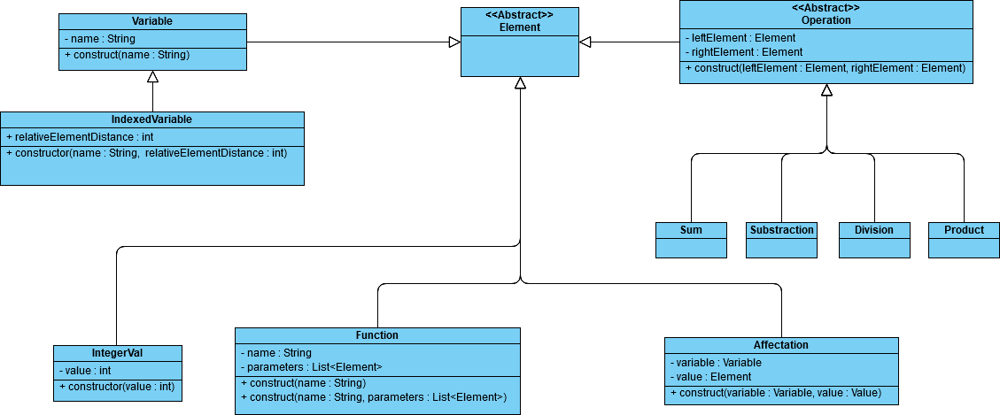

# Conception

## General

Cette application a été conçu modulaire, avec un couplage le plus faible possible entre les différents modules, pour pouvoir être ajoutés, supprimés ou remplacés facilement. On peut ainsi distinguer les modules suivantes :

#### Modèle (package model)

Ce module renferme l'implémentation des tables de décoration et des transduceurs. Il est la base sur laquelle tous les autres modules vont se greffer pour fonctionner.

#### Parseur (package parser)

Ce module contient les parseurs utilisés pour transformer les tables de décoration et transduceurs fournis via du JSON, en une instance du modèle.

#### Générateur (package generator)

Ce module contient les interfaces nécessaires pour pouvoir générer le code. Il est le module sur lequel tous les modules de génération vont hériter pour pouvoir offrir la même interface pour l'utilisateur. C'est via ce module qu'on génèrera le code.

#### Java (package language.java)

Ce module contient les classes pour générer le code JAVA du modèle. Il s'appuie sur le package `generator`, dont il tire l'interface.

#### Manager (package manager)

Ce module permet aux différents modules de fonctionner ensemble. Ainsi, il parse les fichiers d'entrée en utilisant `parser`, et génère le code via le module `generator` en lui envoyant l'instance de `model` créée.

Cette application est faite en sorte qu'on puisse ajouter des parseurs, si l'on veut instancier le modèle via un autre langage que le JSON, ou encore ajouter des générateurs, si l'on souhaite générer le code correspondant en un autre langage que le JAVA. L'architecture est schematisé ci-dessous :

Chaque module expose une classe utilitaire qui en constitue le point d'entrée.

## Modèle

Le modèle est séparé en deux parties principales fortement liés. La première concerne le Transducteur, et la seconde la table de décoration.

### Transducteur

Le Transducteur est composé des classes java suivantes : 
- SeedTransducteur
- State
- Arc

ainsi que des énumérations suivantes :
- ArcSemanticLetter
- ArcOperator

Il représente un transducteur de la manière suivante : La classe **`SeedTransducteur`** possède son _`nom`_, la valeur de son _`before`_ et de son _`after`_, ses _`états`_ sous la forme d'une HasMap, avec comme clé le nom de l'état, ses _`arcs`_ sous la forme d'un HashSet, et enfin son _`état d'initialisation`_.

Les états, quand à eux, sont représentés dans la classe **`State`**, contenant leur _`nom`_.

Enfin, les arcs sont modélisés via la classe **`Arc`**, qui possède l'état de départ et l'état d'arrivée. Un arc est pondéré par un _`opérateur`_, représenté par l'énumération **`ArcOperator`**, et par une _`lettre sémantique`_ représentée par l'énumération **`ArcSemanticLetter`**.

#### Diagramme de classe de l'architecture d'un Transducteur :

### Table de décoration

La table de décoration est représentée principalement par la class **`DecorationTable`**, qui contient son _`nom`_, et _`registres`_ sous la forme d'une HashMap d'**`Element`** dont la clé est le nom du registre, et dont l'élement est la valeur à l'initialisation. Même procédé pour les variables _`returns`_. Les instructions sont, elles, définies dans une HashMap d'**`Instruction`** avec comme clé un objet **`InstructionKey`**.

Cet classe **`InstructionKey`** est composée de deux éléments, une _`Lettre Sémantique`_ (définie dans la partie prédédente) et d'une valeur (optionelle) pour l'_`after`_.

Les instructions sont implémentés par la classe **`Instruction`**. Cette classe est composée d'une HashMap d'**`Element`** représentant les guards, et dont la clé est l'identifiant de la variable modifiée, et d'une HashMap d'**`Element`** pour représenter les updates, fonctionnant de la même manière.

#### Diagramme de classe de l'architecture d'une Table de Décoration :

Concernant ces éléments : 

Un élément est un objet pouvant prendre plusieurs formes, de la variable jusqu'à un calcul en passant par une affectation. On peut ainsi les imbriquer pour former des expressions complexes, et les donner comme guard ou update dans une Table de décoration ou une Instruction.

Tous les élements héritent de la superclasse **`Element`**. On y retrouve une autre classe abstraite en héritant directement : **`Operation`**. Cette classe définit toutes les opérations comme fonction entre deux élements. En hérite : **`Somme`**, **`Soustraction`**, **`Produit`** et **`Division`**. Autre classe héritant directement de **`Element`** : **`Variable`**. Cette classe représente une variable, définie par son _`nom`_. Une variante existe, héritant de **`Variable`** : **`IndexedVariable`**. Cette classe représente une variable, avec un index, représenté par un attribut _`Distance relative`_, qui représente la distance entre l'index voulu et l'index courant. Ainsi, une variable v(i+1) sera notée IndexVariable("v", 1).

Enfin, on retrouve d'autres implémentations de **`Element`**, tels que **`IntegerVal`** représentant juste un integer, par sa _`valeur`_, **`Function`** qui représente une fonction par son _`nom`_ et ses _`paramètres`_ sous la forme d'une liste, et enfin **`Affectation`** qui associe un **`Element`** à une **`Variable`**.

#### Diagramme de classe de l'architecture des Elements :

## Module de parsing

Ce module se découpe en deux modules respectivement spécialisé dans le parsing du transducteur et de la table de décoration. 
Tout deuc produisent des objets résultats contenant les données parsée ainsi que les éventuelles erreurs. 

Ils présentent tout deux une indépendance totale.

### Transducteur

Le parser présente la classe utilitaire `SeedTransducerParser`. La seul méthode présentée fait appel au `SeedTransducerConverter` 
qui se charge du parsing du seed transducer. Le fichier JSON est alors ouvert et mapper à un POJO (`SeedTransducerPOJO`).
L'objet est alors analysé et transformé en `SeedTransducer`.

L'énumération `SeedTransducerJSONElements` resemble les éléments JSON attendu dans le fichier.
 
Le résultat de ce traitement est un objet `SeedTransducerParsingResult`. Ce dernier comprend l'objet `SeedTransduecr`
résultat et/ou les erreurs survenues. Si ces erreurs sont blocante, le parsing est arrêté et aucun objet
`SeedTransducer` ne sera produit. Dans le cas ou le mapping est fait, le POJO est alors analysé. Si des erreurs
ou incohérence sont constaté (état initial non présent dans la liste des états par exemple) ces erreurs
sont ajoutées au résultat. 

Les types d'erreurs sont centralisé dans une énumération `SeedTransducerParserErrorType`. Cela facilite la maintenance
et permet aussi une centralisation des messages d'erreurs. Il est donc facile de les adapter en cas de besoins ou 
de les traduires.

Cette implémentation renvoie ainsi un objet résultat et offre une indépendance certain de ce module. 
Il est aussi aisé de le remplacer par un autre en cas de besoin. 
Aussi si l'ont souhaite s'en servir dans un autre programme ou y brancher une interface graphique, tout les 
éléments sont disponible y compris les informations de traitement. 

### Table de décoration

## Module de génération

// Todo

## Module de génération Java

// Todo

## // TODO: Autres modules