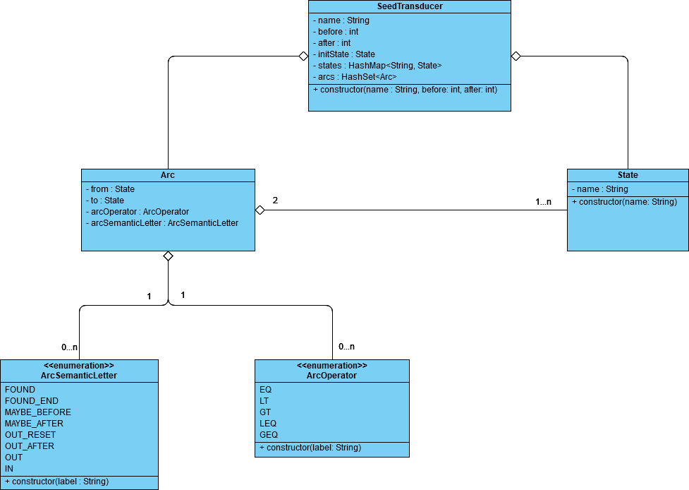

# Conception

## General

Cette application a été conçu 
- modèle
    - table de décoration
    - transducteur
- parser
    - transducteur
    - table de décoration
- manager
- générateur

Chaque module expose une classe utilitaire qui en constitue le point d'entrée.

## Modèle

### Table de décoration

## Module de parsing

Ce module se découpe en deux modules respectivement spécialisé dans le parsing du transducteur et de la table de décoration. 
Tout deuc produisent des objets résultats contenant les données parsée ainsi que les éventuelles erreurs. 

Ils présentent tout deux une indépendance totale.

### Transducteur

Le parser présente la classe utilitaire `SeedTransducerParser`. La seul méthode présentée fait appel au `SeedTransducerConverter` 
qui se charge du parsing du seed transducer. Le fichier JSON est alors ouvert et mapper à un POJO (`SeedTransducerPOJO`).
L'objet est alors analysé et transformé en `SeedTransducer`.

L'énumération `SeedTransducerJSONElements` resemble les éléments JSON attendu dans le fichier.
 
Le résultat de ce traitement est un objet `SeedTransducerParsingResult`. Ce dernier comprend l'objet `SeedTransduecr`
résultat et/ou les erreurs survenues. Si ces erreurs sont blocante, le parsing est arrêté et aucun objet
`SeedTransducer` ne sera produit. Dans le cas ou le mapping est fait, le POJO est alors analysé. Si des erreurs
ou incohérence sont constaté (état initial non présent dans la liste des états par exemple) ces erreurs
sont ajoutées au résultat. 

Les types d'erreurs sont centralisé dans une énumération `SeedTransducerParserErrorType`. Cela facilite la maintenance
et permet aussi une centralisation des messages d'erreurs. Il est donc facile de les adapter en cas de besoins ou 
de les traduires.

Cette implémentation renvoie ainsi un objet résultat et offre une indépendance certain de ce module. 
Il est aussi aisé de le remplacer par un autre en cas de besoin. 
Aussi si l'ont souhaite s'en servir dans un autre programme ou y brancher une interface graphique, tout les 
éléments sont disponible y compris les informations de traitement. 

### Table de décoration

## Module 