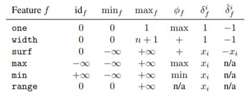
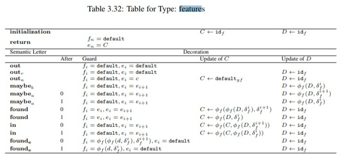

# Syntaxe de la table de décoration

## Format
La table de décoration est formalisé sous forme d'un objet JSON décrivant : 
- `decoration_table` `{}` : seed template
    - `name` `""` : nom de la table de décoration
    - `registers` `[{}]` : liste des registres
        - `name` `""` : nom du registre
        - `value` `{}` : valeur d'initialisation du registre
            - soit `fonction` `{}` : objet fonction
                - `name` `""` : nom de la fonction
            - soit `variable` `{}` : objet variable
                - `name` `""` : nom de la variable
                - `index` `""` : (facultatif) index de la variable 
    - `returns` `[{}]` : liste des valeur à retourner
        - `name` `""` : nom de la variable de retour
        - `index` `""` : index de la variable de retour
        - `value` `{}` : valeur d'initialisation de la variable de retour
            - soit `fonction` `{}` : objet fonction
                - `name` "" : nom de la fonction
            - soit `variable` `{}` : objet variable
                - `name` `""` : nom de la variable
                - `index` `""` : (facultatif) index de la variable 
    - `table` `[{}]` : liste des instructions
        - `letter` `""` : lettre sémantique
        - `guards` `[{}]` : (facultatif) liste des guards en référence à un return déclaré plus haut
            - `variable` `""` : nom de la variable qui sera mise à jour
                - `index` `""` : index de la variable à mettre à jour
                - `value` `{}` : valeur à affecter
                    - soit `fonction` `{}` : objet fonction
                        - `name` `""` : nom de la fonction
                        - `parameters` `[]` : (facultatif) liste des paramètres à fournir en entrée de la fonction, il peut s'agir de :  
                            - `""` : référence à une variable
                            - `""` : un index
                            - `fonction` `{}` (`name` et `parameters`) : résultat d'une fonction
                            - `variable` `{}` (`value` (`function` ou `variable`) et `index`) : référence à une variable 
                    - soit `variable` `{}` : objet variable
                        - `name` `""` : nom de la variable
                        - `index` `""` : index de la variable (facultatif)
        - `updates` `[{}]` : (facultatif) liste des mises à jour affectant les registres
            - `variable` `""` : nom du registre à affecter
            - `value` `{}` : valeur à affecter
                - soit `fonction` `{}` : objet fonction
                    - `name` `""` : nom de la fonction
                    - `parameters` `[]` : (facultatif) liste des paramètres à fournir en entrée de la fonction, il peut s'agir de :  
                        - `""` : référence à une variable
                        - `""` : un index
                        - `fonction` `{}` (`name` et `parameters`) : résultat d'une fonction
                        - `variable` `{}` (`value` (`function` ou `variable`) et `index`) : référence à une variable   
                - soit `variable` `{}` : objet variable
                    - `name` `""` : nom de la variable
                    - `index` `""` : index de la variable (facultatif)

### Lettres sémantiques
Le champs `letter` peut prendre les valeurs suivantes :
- `found`
- `found(end)`
- `maybe(before)`
- `maybe(after)`
- `out(reset)`
- `in`
- `out(after)`
- `out`

### Fonction prédéfinit
Un autre élément peut aussi être utilisé au cours de la définition du JSON de représentation de la table de décoration`default`. 
La valeur de ce dernier sera à fournir en entrée du code généré par le générateur à partir du transducer et de la table de décoration fournis. 

Les fonctions données dans le JSON peuvent utiliser le nom d'une des fonctions présentées dans le tableau suivant et connu du générateur : 

La première colonne correspond à la feature donnée en entrée au programme généré et définira l'implémentation de la fonction référencée.

## Exemple

Le JSON suivant décrit un exemple de représentation de la table de décoration Feature.

 
```json
{
  "name": "feature",
  "registers": [
    {
      "name": "C",
      "value": {
        "function": {
          "name": "id"
        }
      }
    },
    {
      "name": "D",
      "value": {
        "function": {
          "name": "id"
        }
      }
    }
  ],
  "returns": [
    {
      "name": "f",
      "index": "n",
      "value": {
        "function": {
          "name": "default"
        }
      }
    },
    {
      "name": "e",
      "index": "n",
      "value": {
        "variable": {
          "name": "C"
        }
      }
    }
  ],
  "table": [
    {
      "letter": "out",
      "guards": [{
        "variable": "f",
        "index": "i",
        "value": {
          "function": {
            "name": "default"
          }
        }
      },
        {
          "variable": "e",
          "index": "i",
          "value": {
            "function": {
              "name": "default"
            }
          }
        }]
    },
    {
      "letter": "out(reset)",
      "guards": [{
        "variable": "f",
        "index": "i",
        "value": {
          "function": {
            "name": "default"
          }
        }
      },{
        "variable": "e",
        "index": "i",
        "value": {
          "function": {
            "name": "default"
          }
        }
      }],
      "updates": [
        {
          "variable": "D",
          "value": {
            "function": {
              "name": "id"
            }
          }
        }]
    },
    {
      "letter": "out(after)",
      "guards": [{
        "variable": "f",
        "index": "i",
        "value": {
          "function": {
            "name": "default"
          }
        }
      },
        {
          "variable": "e",
          "index": "i",
          "value": {
            "variable": {
              "name": "C"
            }
          }
        }],
      "updates": [{
        "variable": "C",
        "value": {
          "function": {
            "name": "default"
          }
        }}, {
        "variable": "D",
        "value": {
          "function": {
            "name": "id"
          }
        }
      }]
    },
    {
      "letter": "maybe(before)",
      "guards": [{
        "variable": "f",
        "index": "i",
        "value": {
          "function": {
            "name": "default"
          }
        }
      }, {
        "variable": "e",
        "index": "i",
        "value": {
          "variable": {
            "name": "e",
            "index": "i+1"
          }
        }
      }],
      "updates": [
        {
          "variable": "D",
          "value": {
            "function": {
              "name": "phi",
              "parameters": ["D", {
                "function": {
                  "name": "delta",
                  "parameters": ["i"]
                }
              }]
            }
          }
        }
      ]
    },
    {
      "letter": "maybe(after)",
      "after": 0,
      "guards": [{
        "variable": "f",
        "index": "i",
        "value": {
          "function": {
            "name": "default"
          }
        }
      }, {
        "variable": "e",
        "index": "i",
        "value": {
          "variable": {
            "name": "e",
            "index": "i+1"
          }
        }
      }],
      "updates": [
        {
          "variable": "D",
          "value": {
            "function": {
              "name": "phi",
              "parameters": ["D", {
                "function": {
                  "name": "delta",
                  "parameters": ["i+1"]
                }
              }]
            }
          }
        }
      ]
    },
    {
      "letter": "maybe(after)",
      "after": 1,
      "guards": [{
        "variable": "f",
        "index": "i",
        "value": {
          "function": {
            "name": "default"
          }
        }
      }, {
        "variable": "e",
        "index": "i",
        "value": {
          "variable": {
            "name": "e",
            "index": "i+1"
          }
        }
      }],
      "updates": [
        {
          "variable": "D",
          "value": {
            "function": {
              "name": "phi",
              "parameters": ["D", {
                "function": {
                  "name": "delta",
                  "parameters": ["i"]
                }
              }]
            }
          }
        }
      ]
    },
    {
      "letter": "found",
      "after": 0,
      "guards": [{
        "variable": "f",
        "index": "i",
        "value": {
          "variable": {
            "name": "e",
            "index": "i"
          }
        }
      }, {
        "variable": "e",
        "index": "i",
        "value": {
          "variable": {
            "name": "e",
            "index": "i+1"
          }
        }
      }],
      "updates": [
        {
          "variable": "C",
          "value": {
            "function": {
              "name": "phi",
              "parameters": [{
                "function": {
                  "name": "phi",
                  "parameters": ["D", {
                    "function": {
                      "name": "delta",
                      "parameters": ["i"]
                    }
                  }]
                }
              }, {
                "function": {
                  "name": "delta",
                  "parameters": ["i+1"]
                }
              }]
            }
          }
        }, {
          "variable": "D",
          "value": {
            "function": {
              "name": "id"
            }
          }
        }
      ]
    },
    {
      "letter": "found",
      "after": 1,
      "guards": [{
        "variable": "f",
        "index": "i",
        "value": {
          "variable": {
            "name": "e",
            "index": "i"
          }
        }
      }, {
        "variable": "e",
        "index": "i",
        "value": {
          "variable": {
            "name": "e",
            "index": "i+1"
          }
        }
      }],
      "updates": [
        {
          "variable": "C",
          "value": {
            "function": {
              "name": "phi",
              "parameters": ["D", {
                "function": {
                  "name": "delta",
                  "parameters": ["i"]
                }
              }]
            }
          }
        }, {
          "variable": "D",
          "value": {
            "function": {
              "name": "id"
            }
          }
        }
      ]
    },
    {
      "letter": "in",
      "after": 0,
      "guards": [{
        "variable": "f",
        "index": "i",
        "value": {
          "function": {
            "name": "default"
          }
        }
      }, {
        "variable": "e",
        "index": "i",
        "value": {
          "variable": {
            "name": "e",
            "index": "i+1"
          }
        }
      }],
      "updates": [
        {
          "variable": "C",
          "value": {
            "function": {
              "name": "phi",
              "parameters": ["C",
                {"function": {
                  "name": "phi",
                  "parameters": ["D", {
                    "function": {
                      "name": "delta",
                      "parameters": ["i+1"]
                    }
                  }]
                }}]
            }
          }
        }, {
          "variable": "D",
          "value": {
            "function": {
              "name": "id"
            }
          }
        }
      ]
    },{
      "letter": "in",
      "after": 1,
      "guards": [{
        "variable": "f",
        "index": "i",
        "value": {
          "function": {
            "name": "default"
          }
        }
      }, {
        "variable": "e",
        "index": "i",
        "value": {
          "variable": {
            "name": "e",
            "index": "i+1"
          }
        }
      }],
      "updates": [
        {
          "variable": "C",
          "value": {
            "function": {
              "name": "phi",
              "parameters": ["C",
                {"function": {
                  "name": "phi",
                  "parameters": ["D", {
                    "function": {
                      "name": "delta",
                      "parameters": ["i"]
                    }
                  }]
                }}]
            }
          }
        }, {
          "variable": "D",
          "value": {
            "function": {
              "name": "id"
            }
          }
        }
      ]
    },
    {
      "letter": "found(end)",
      "after": 0,
      "guards": [{
        "variable": "f",
        "index": "i",
        "value": {
          "function": {
            "name": "phi",
            "parameters": [{
              "function": {
                "name": "phi",
                "parameters": ["D", {
                  "function": {
                    "name": "delta",
                    "parameters": ["i"]
                  }
                }]
              }
            }, {
              "function": {
                "name": "delta",
                "parameters": ["i+1"]
              }
            }]
          }
        }
      }, {
        "variable": "e",
        "index": "i",
        "value": {
          "function": {
            "name": "default"
          }
        }
      }],
      "updates": [{
        "variable": "D",
        "value": {
          "function": {
            "name": "id"
          }
        }
      }
      ]
    },
    {
      "letter": "found(end)",
      "after": 1,
      "guards": [{
        "variable": "f",
        "index": "i",
        "value": {
          "function": {
            "name": "phi",
            "parameters": ["D", {
              "function": {
                "name": "delta",
                "parameters": ["i"]
              }
            }]
          }
        }
      }, {
        "variable": "e",
        "index": "i",
        "value": {
          "function": {
            "name": "default"
          }
        }
      }],
      "updates": [
        {
          "variable": "D",
          "value": {
            "function": {
              "name": "id"
            }
          }
        }
      ]
    }
  ]
}
```