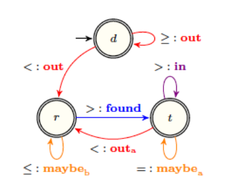
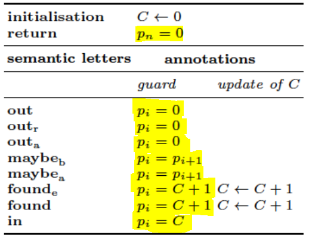
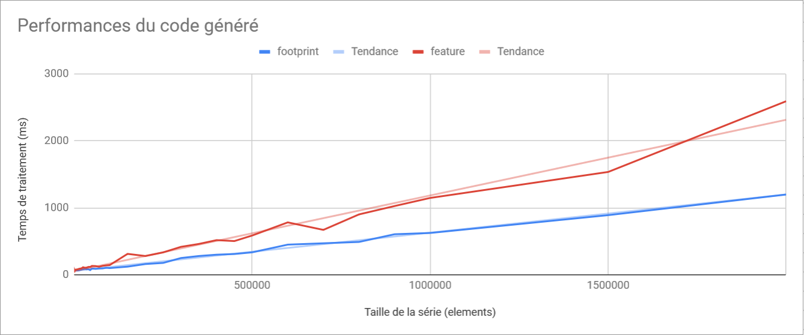

# Code généré

## Algorithme cible

Durant ce projet, deux algorithmes ont été pensés et testés. Le second étant une évolution du premier, pour cause de performances limités.

### Structure

L'agorithme retenu réside dans le principe suivant :
- Une **`fonction principale`**, servant de point d'entrée, de déclaration de variables, et contenant la boucle d'exécution principale qui parcours la série temporelle. Cette fonction prend en paramètre la `série temporelle`, la `feature`, et la valeur `default`, et retournant un tableau à deux dimensions correspondant à la liste des élements calculés à chaque pas de l'algorithme ;
- Des **`fonctions correspondants aux Lettres Syntaxiques`** (maybe_before, out, after ...) et contenant les instructions définies dans la table de décoration pour chacune de ces lettres, et selon la valeur de l'after du transducteur ;
- Des **`fonctions correspondants aux fonctions pré-définies`** (id, phi, delta ...) qui peuvent-être utilisés dans la table de décoration, et prenant en paramètre la `feature` choisie par l'utilisateur, et retournant une valeur entière.

Ce qui nous donne ceci :

```
/** 
 * Fonction principale
 */
Fonction process(serie : Entier[],
                 feature : Feature,
                 default : Entier) :  String[Entier[]]

/**
 * Fonctions "Lettres sémantiques"
 */
Fonction maybe_after()

Fonction maybe_before()

Fonction found()

Fonction in()

Fonction out_reset()

Fonction found_end()

Fonction out_after()

Fonction out()

/**
 * Fonctions pré définies
 */
Fonction id(feature : Feature) : Entier

Fonction min(feature : Feature) : Entier

Fonction max(feature : Feature) : Entier

Fonction phi(feature : Feature,
             arg1 : Entier,
             arg2: Entier) : Entier

Fonction delta(feature : Feature,
               index : Entier) : Entier

Fonction delta2(feature : Feature,
                index : Entier) : Entier

```

### Algorithme

L'algorithme retenu fonctionne de la manière suivante : 
- Une boucle dans la fonction principale, parcourant la série temporelle, en déterminant à chaque tour de boucle l'état courant, et l'état futur, en appelant à chaque fois la bonne fonction "Lettre sémantique" entre deux états.

Ainsi, le transducteur suivant `PEAK` :



est parcourue de la manière suivante :
```
état <- "d"
i <- 0
TANT_QUE(i < longueur(série - 1) {
    SI (état == "r")
        SI (série[i] <= série[i+1]) {
            maybe_before()
            i <- i+1
            état <- "r"
        SINON_SI (série[i] > série[i+1])
            found()
            i <- i+1
            état <- "t"
        FIN_SI
    SINON_SI (état == "d")
        SI (série[i] >= série[i+1])
            out()
            i <- i+1
            état <- "d"
        SINON_SI (série[i] < série[i+1])
            out()
            i <- i+1
            état <- "r"
        FIN_SI
    SINON_SI (état == "t")
        SI (série[i] > série[i+1]) {
            in()
            i <- i+1
            état <- "t"
        SINON_SI (série[i] == série[i+1])
            maybe_after()
            i <- i+1
            état <- "t"
        SINON_SI (série[i] < série[i+1])
            out_after()
            i <- i+1
            état <- "r"
        FIN_SI
    FIN_SI
FIN_TANT_QUE
```

En ce qui concerne les variables utilisés et leur définition, elle sont définies comme suit :
- Une HashMap contenant des listes de fonctions temporaires, stockées selon la variable à laquelle elle sont rattachées.
Exemple : 
Dans ce cas, les p(i) = EXPRESSION ne peuvent pas forcément être calculés directement puisqu'ils peuvent dépendre d'un p(i+1) pas encore calculé. Ainsi, pour cette table de décoration, la HashMap de fonctions ressemblera à ça :
```
Hashmap fonctions["p" -> Fonction[
                            0 -> fonction_1,
                            1 -> fonction_2,
                            ...
                            n -> fonction_n;
                         ]
                 ]
```


## Tests de performances

// Todo



## Tests de validation

// Todo