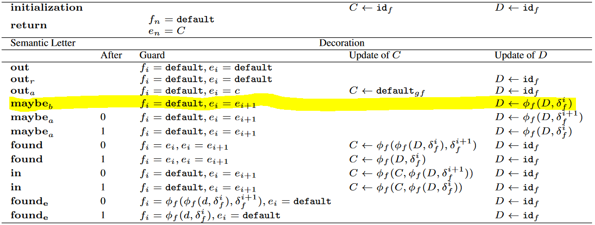
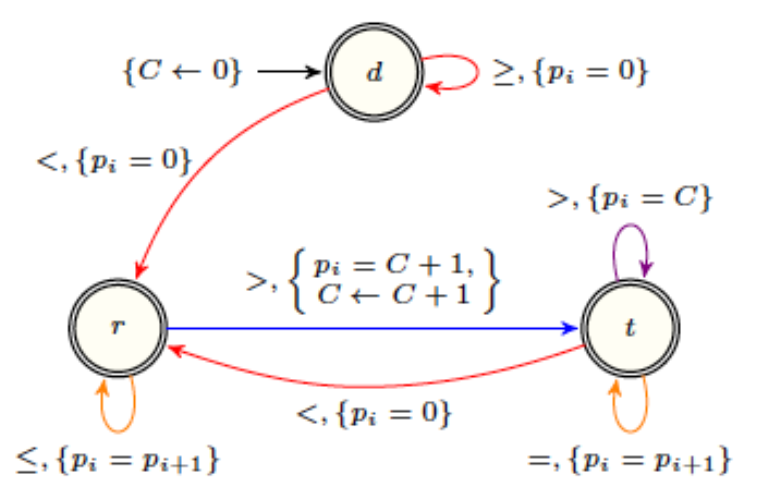

# Code généré

## Algorithme cible

Durant ce projet, deux algorithmes ont été pensés et testés. Le second étant une évolution du premier, pour cause de performances limités.

### Structure

L'agorithme retenu réside dans le principe suivant :
- Une **`fonction principale`**, servant de point d'entrée, de déclaration de variables, et contenant la boucle d'exécution principale qui parcours la série temporelle. Cette fonction prend en paramètre la `série temporelle`, la `feature`, et la valeur `default`, et retournant un tableau à deux dimensions correspondant à la liste des élements calculés à chaque pas de l'algorithme ;
- Des **`fonctions correspondants aux Lettres Syntaxiques`** (maybe_before, out, after ...) et contenant les instructions définies dans la table de décoration pour chacune de ces lettres, et selon la valeur de l'after du transducteur ;
- Des **`fonctions correspondants aux fonctions pré-définies`** (id, phi, delta ...) qui peuvent-être utilisés dans la table de décoration, et prenant en paramètre la `feature` choisie par l'utilisateur, et retournant une valeur entière.

Ce qui nous donne ceci :

```
/** 
 * Fonction principale
 */
Fonction process(serie : Entier[],
                 feature : Feature,
                 default : Entier) :  String[Entier[]]

/**
 * Fonctions "Lettres sémantiques"
 */
Fonction maybe_after()

Fonction maybe_before()

Fonction found()

Fonction in()

Fonction out_reset()

Fonction found_end()

Fonction out_after()

Fonction out()

/**
 * Fonctions pré définies
 */
Fonction id(feature : Feature) : Entier

Fonction min(feature : Feature) : Entier

Fonction max(feature : Feature) : Entier

Fonction phi(feature : Feature,
             arg1 : Entier,
             arg2: Entier) : Entier

Fonction delta(feature : Feature,
               index : Entier) : Entier

Fonction delta2(feature : Feature,
                index : Entier) : Entier

```

### Algorithme

L'algorithme retenu fonctionne de la manière suivante : 
- Une boucle dans la fonction principale, parcourant la série temporelle, en déterminant à chaque tour de boucle l'état courant, et l'état futur, en appelant à chaque fois la bonne fonction "Lettre sémantique" entre deux états.

Ainsi, le transducteur suivant `PEAK` :


est parcourue de la manière suivante :
```
état <- "d"
i <- 0
TANT_QUE(i < longueur(série - 1) {
    SI (état == "r")
        SI (série[i] <= série[i+1]) {
            maybe_before()
            i <- i+1
            état <- "r"
        SINON_SI (série[i] > série[i+1])
            found()
            i <- i+1
            état <- "t"
        FIN_SI
    SINON_SI (état == "d")
        SI (série[i] >= série[i+1])
            out()
            i <- i+1
            état <- "d"
        SINON_SI (série[i] < série[i+1])
            out()
            i <- i+1
            état <- "r"
        FIN_SI
    SINON_SI (état == "t")
        SI (série[i] > série[i+1]) {
            in()
            i <- i+1
            état <- "t"
        SINON_SI (série[i] == série[i+1])
            maybe_after()
            i <- i+1
            état <- "t"
        SINON_SI (série[i] < série[i+1])
            out_after()
            i <- i+1
            état <- "r"
        FIN_SI
    FIN_SI
FIN_TANT_QUE
```

En ce qui concerne les variables utilisés et leur définition, elle sont définies comme suit :
- Une HashMap contenant des listes de fonctions temporaires, stockées selon la variable à laquelle elle sont rattachées.
Exemple :

Dans ce cas, les p(i) = EXPRESSION ne peuvent pas forcément être calculés directement puisqu'ils peuvent dépendre d'un p(i+1) pas encore calculé. Ainsi, pour cette table de décoration, la HashMap de fonctions ressemblera à ça :
```
Hashmap fonctions["p" -> Fonction[
                            0 -> fonction_1,
                            1 -> fonction_2,
                            ...
                            n -> fonction_n;
                         ]
                 ]
```
- Une HashMap contenant, pour chaque registre, sa valeur courante. Pour l'exemple précédent, elle sera définie de la manière suivante :
```
Hashmap registers["C" -> valeur_courante]
```
- Une HashMap contenant, pour chaque registres et chaque variable, sa valeur à chaque pas. C'est cette HashMap qui sera renvoyée par l'algorighme. Pour l'exemple précédent, elle sera définie de la manière suivante : 
```
Hashmap results["C" -> Entier[
                            0 -> entier_1,
                            1 -> entier_2,
                            ...
                            n -> entier_n;
                         ],
                  "p" -> Entier[
                            0 -> entier_1,
                            1 -> entier_2,
                            ...
                            n -> entier_n;
                         ]
                 ]
```

Concernant les fonctions relatives aux lettres sémantiques, leurs instructions découlent directement de la table de décoration associée. Par exemple pour la table FEATURE suivante, et la fonction maybe_before :



Son résultat en pseudo-code est le suivant :

```
Fonction maybe_before() {
    // Définitions de variables avec une portée locale pour les fonctions à exécuter plus tard
    Entier i <- currentI
    Entier C <- registers["C"]
    Entier D <- registers["D"]
    // Définition des fonctions a exécuter plus tard
    Fonction fonction1 <- (() -> results["e"][i+1])
    fonctions["e"][i] <- fonction1
    Fonction fonction2 <- (() -> default_fun(this.feature))
    fonctions["f"][i] <- fonction2
    // Mise à jour des registres
    registers["D"] <- phi(feature, D, delta(feature, i))
    results["C"][i] <- registers["C"]
    results["D"][i] <- registers["D"]
Fin_Fonction
```

Les fonctions pré-définies sont connues du programme et dépendent de la feature. Elles sont les suivantes :


Dans le code généré, elles sont toutes implémentés de la même manière. Ainsi prenons l'exemple de la fonction max, implémentée de la sorte :

```
Fonction max(feature : Feature) : Entier
    SELON(feature)
        CAS FEATURE.ONE:
            retourner 1;
        CAS FEATURE.WIDTH:
            retourner longueur(série) + 1
        CAS FEATURE.SURF:
            retourner INFINITY
        CAS FEATURE.MAX:
            retourner INFINITY
        CAS FEATURE.MIN:
            retourner INFINITY
        CAS FEATURE.RANGE:
            retourner INFINITY
    FIN_SELON
Fin_Fonction
```

Autre exemple, celui de la fonction delta :

```
Fonction delta(feature : Feature, int index) : Entier
    SELON(feature)
        CAS FEATURE_ONE:
            retourner 1
        CAS FEATURE_WIDTH:
            retourner 1
        CAS FEATURE_SURF:
            retourner série[index]
        CAS FEATURE_MAX:
            retourner série[index]
        CAS FEATURE_MIN:
            retourner série[index]
        CAS FEATURE_RANGE:
            retourner série[index]
    FIN_SELON
Fin_Fonction
```

Enfin, la dernière partie du programme consiste en l'exécution de toutes les fonctions stockés, par indice décroissant. C'est fait de la manière suivante :

```
// Pour toutes les listes de fonctions dans fonctions
POUR(variable ET valeurs DE fonctions)
    // Pour toutes les fonctions de la liste (par index décroissant)
    POUR(i décroissant de taille(valeurs) -1 à 0)
        // Exécution de la fonction située dans valeurs[i]
        results[variable][i] <- valeurs[i]()
    FIN_POUR
FIN_POUR
```

**Complexité**

L'algorithme parcours deux fois la série temporelle, une fois pour traiter l'ensemble des lettres sémantiques et stocker les fonctions dans, et une autre fois pour résoudre toutes ces fonctions. La complexité de cet algorithme est donc de O(2n).

## Tests de performances

Nous avons effectués des tests de performance du code en sortie.
Initialisation du test : 
- Le code généré est en Java ;
- La taille de la série temporelle a varié de 10 éléments à 5 millions d'éléments ;
- Les tests ont été réalisés avec un intel code i7 6500U cadencé à 2,50GHz (2 coeurs physiques, 4 coeurs virtuels), une mémoire vive de 2Go attribuée à la Java Virtual Machine, via le logiciel IntelliJ IDEA (version 2018.1) ;
- Les tests ont été réalisé avec deux codes générés différents :
    - L'un à base du transducteur `peak` et de la table `footprint` ;
    - L'autre à base du transducteur `peak` et de la table `feature`.

Les résultats de ces tests de performance sont visibles sur le graphique suivant :


Comme montré par les lignes `Tendances`, le temps de traitement croit linéairement en fonction du nombre d'éléments dans la série temporelle.

**Limite**

Dans le cas présent, il est impossible de calculer le temps de traitement pour une série temporelle supérieure à 2 millions d'entrées, car la mémoire attribuée à la JVM était pleine. Ainsi, avec 2Go de mémoire vive, il est possible d'analyser une série de 2 millions d'entrée.

**Perspectives**

Il n'est certainement pas impossible d'optimiser encore plus l'algorithme. Sa une complexité plus qu'acceptable, car linéaire. Seulement, niveau mémoire utilisé, il est certainement possible d'améliorer encore, pour pouvoir traiter plus de données dans avec une mémoire équivalente.

Le temps de traitement pourrait cependant être amélioré, en parallélisant des taches, pour gagner quelques millisecondes pour une petite série temporelle, qui pourrait donner un gain de temps encore plus gros lors d'une mise à l'échelle de plusieurs millions voir milliards de données.

## Tests de validation

Pour valider le code généré, des tests doivent-être faits sur les résultats de l'exécution de ce code. Ainsi, il faut définir, pour une série, un transducteur et une table de décoration donnée, des résultats.

Exemple avec le transducteur `PEAK`, la table de décoration `FOOTPRINT`, et la série temporelle suivante : `{4, 4, 2, 2, 3, 5, 5, 6, 3, 1, 1, 2, 2, 2, 2, 2, 2, 1}`.

Voici ce que donne le transducteur, une fois décoré par la table de décoration :



Lorsque l'algorithme est déroulé, cela donne la figure suivante :


Ce qui nous donne en résultats pour les variables `p` et `C` :

`C = {0, 0, 0, 0, 0, 0, 0, 1, 1, 1, 1, 1, 1, 1, 1, 1, 2, 0}`

`p = {0, 0, 0, 0, 1, 1, 1, 1, 1, 0, 0, 2, 2, 2, 2, 2, 2, 0}`

**Note :** la valeur `0` est ajoutée à la fin, pour se prémunir d'une éventuelle opération à `i=n`, faisant référence à un i+1 non défini.

Le test consiste donc à vérifier que les résultats en sortie de `C` et `p` correspondent aux résultats attentus. Ainsi le test en Java donne :

```
public void testPeakFootprintSample() {
    int[] timeSerie = {4, 4, 2, 2, 3, 5, 5, 6, 3, 1, 1, 2, 2, 2, 2, 2, 2, 1};
    int[] results_c = {0, 0, 0, 0, 0, 0, 0, 1, 1, 1, 1, 1, 1, 1, 1, 1, 2, 0};
    int[] results_p = {0, 0, 0, 0, 1, 1, 1, 1, 1, 0, 0, 2, 2, 2, 2, 2, 2, 0};

    Peak_footprint generatedCode = new Peak_footprint();
    HashMap<String, ArrayList<Integer>> results = generatedCode.resolve(timeSerie, Peak_footprint.FEATURE_ONE, 0);

    results.forEach((key, table) -> {
        if (key.equals("C")) {
            int i = 0;
            for (int value : table) {
                assertEquals(value, results_c[i]);
                i++;
            }
        } else if (key.equals("p")) {
            int i = 0;
            for (int value : table) {
                assertEquals(value, results_p[i]);
                i++;
            }
        }
    });
}
```

Le code réussit avec succès ce test.

**Améliorations**

Pour avoir des tests plus poussés et plus représentatif de la précision du code généré, il faudrait réitérer le processus de création de test pour d'autres combinaisons `Transducteur` /  `Table de décoration`, ce qui implique de :
- Créer une série temporelle qui fait apparaitre le pattern,
- Dérouler l'algorithme dessus,
- Faire un tableau de résultats,
- Générer le code correspondant,
- Ecrire le test,
- L'implémenter avec le code généré.

Notre volonté était de bien tester le code généré, seulement l'échéance du projet nous a limité en temps pour implémenter plus de tests.